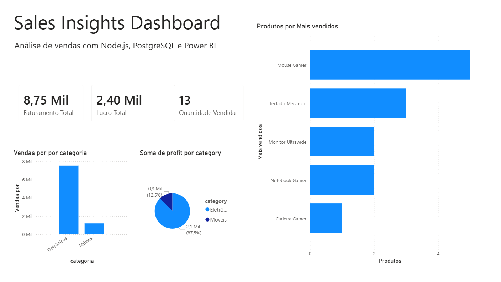
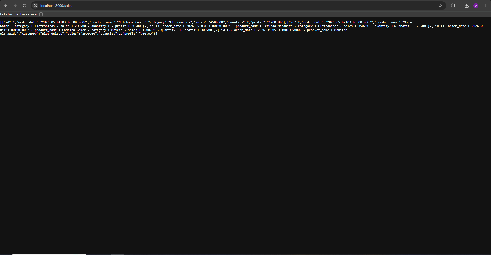
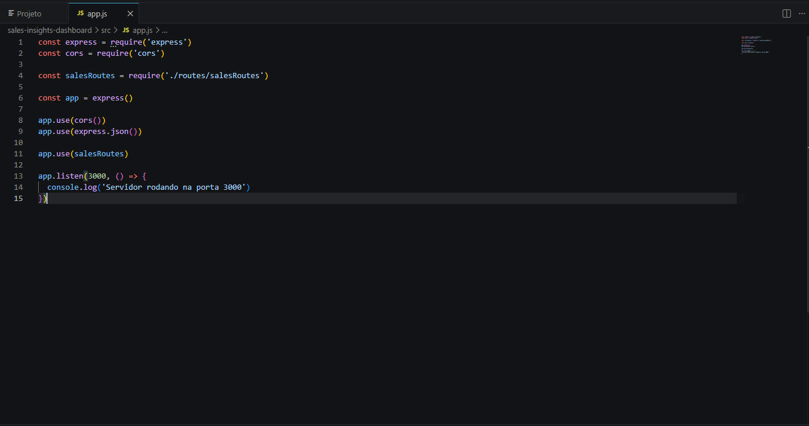
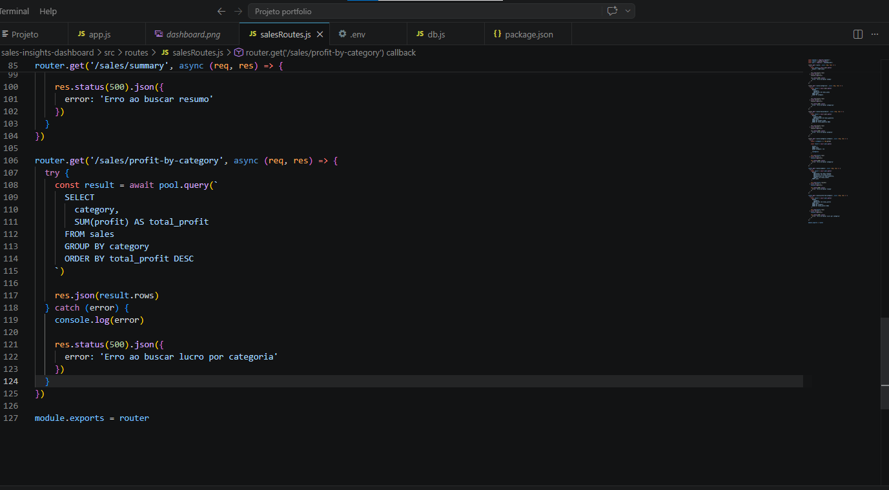

# Sales Insights Dashboard

Projeto de análise de vendas desenvolvido com Node.js, PostgreSQL e Power BI.

## Sobre o projeto

Este projeto foi criado para praticar desenvolvimento backend, integração com banco de dados e visualização de dados.

A aplicação utiliza uma API REST em Node.js conectada ao PostgreSQL para consultar dados de vendas. Os dados são utilizados em um dashboard criado no Power BI para gerar análises visuais e indicadores de negócio.

---

## Tecnologias utilizadas

- JavaScript
- Node.js
- Express
- PostgreSQL
- SQL
- Power BI
- Git e GitHub

---

## Funcionalidades

- Listagem de vendas
- Resumo geral de vendas
- Vendas por categoria
- Lucro por categoria
- Produtos mais vendidos
- Dashboard interativo no Power BI

---

## Estrutura do projeto

```bash
src/
├── database/
│   └── db.js
├── routes/
│   └── salesRoutes.js
└── app.js
```

---

## Como executar o projeto

### Instalar dependências

```bash
npm install
```

### Rodar o servidor

```bash
npm run dev
```

Servidor disponível em:

```bash
http://localhost:3000
```

---

## Endpoints da API

### Buscar todas as vendas

```bash
GET /sales
```

### Buscar vendas por categoria

```bash
GET /sales/by-category
```

### Buscar lucro por categoria

```bash
GET /sales/profit-by-category
```

### Buscar resumo geral

```bash
GET /sales/summary
```

---

## Dashboard Power BI

### Dashboard completo



---

## API funcionando



---

## Código da aplicação

### app.js



### salesRoutes.js



---

## Objetivo

O objetivo deste projeto foi praticar:

- criação de APIs REST
- integração com PostgreSQL
- consultas SQL
- organização backend
- visualização de dados
- construção de portfólio para estágio
